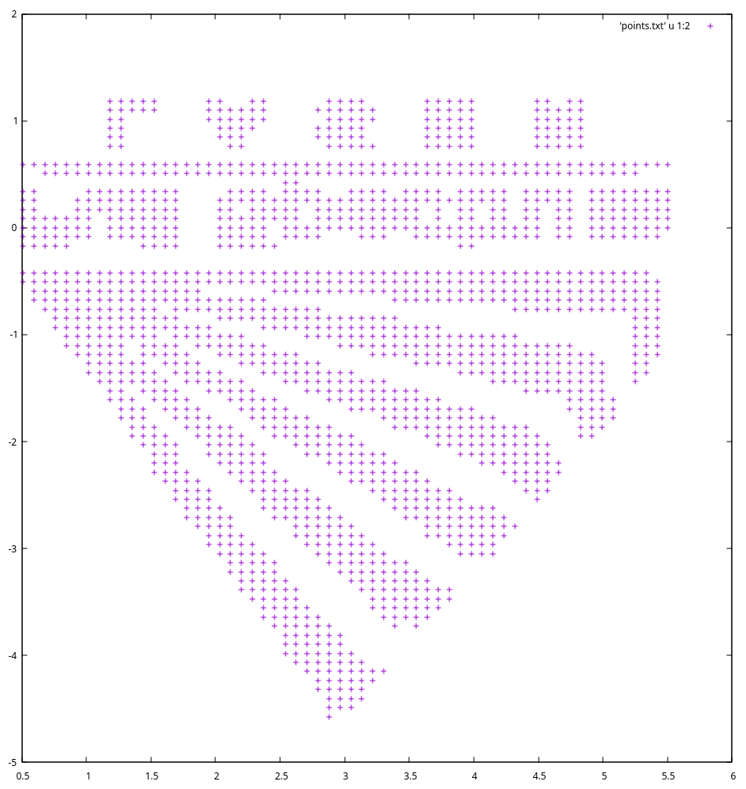
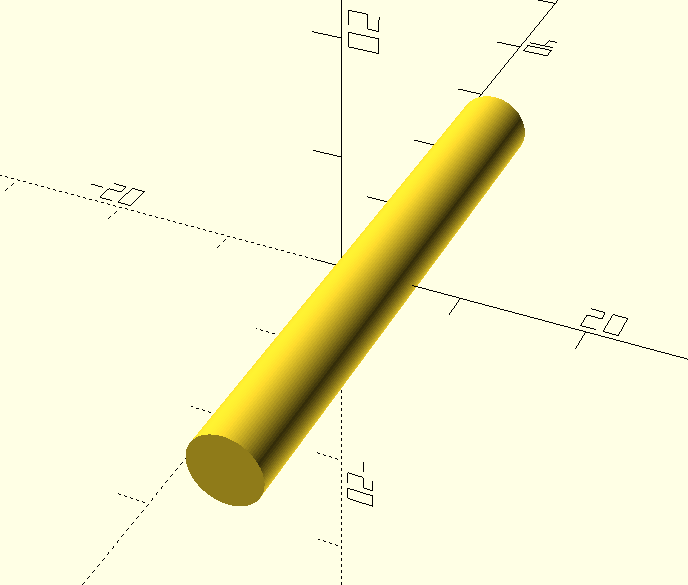
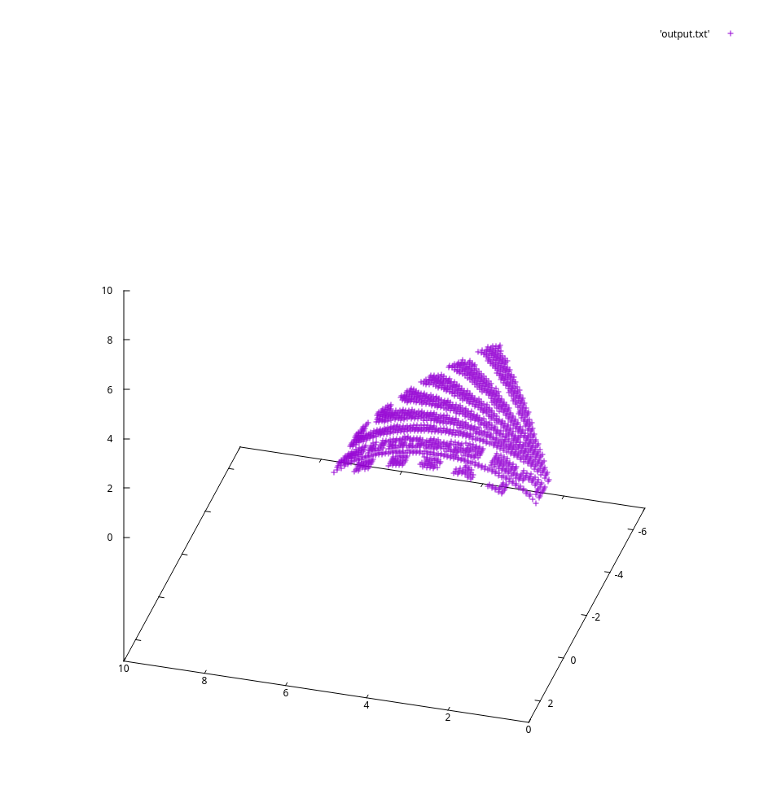

# conformal_opencl


|Input Points|Input STL Model|Output Points|
|:-:|:-:|:-:|
|  |  |  |

## Dependences

Most C programs are written in ISO C. However some of the environmental configuration would be nasty for `clang` when you are compiling OpenCL kernel program. `glibc` is recommended instead. As for the The OpenCL driver, it really depends on the platform you have. You should check your OS instruction for the driver packages needed. In Archlinux they are

**Runtime**
- OpenCL (For C binary)
	- Intel GPU: `intel-compute-runtime`
	- Intel CPU: `intel-opencl-runtime<sup>AUR</sup>`
	- Nvidia GPU: `opencl-nvidia`
	- AMD GPU: `opencl-mesa`
	- AMD CPU: Not supported anymore.

- Tools (For shell script)
	- `time`: Linux built-in, GNU version also works.
	- `gnuplot`: For data analysis and visualization.
	- `ffmpeg`: For MP4 video generation.
	- `clinfo`: good for monitoring all possible platform properties of the system.

**Development**
- ICD loader: `ocl-icd`
- Headers: `opencl-headers`
## Compile
```shell
> cd src
> make
gcc -g -m64 -c launcher.c -o launcher.c.o
gcc -g -m64 -c conformal.c -o conformal.c.o
gcc -std=c99 -Wall -DUNIX -g -DDBUG -o launcher launcher.c.o conformal.c.o   -lOpenCL -lm
```
## Usage
1. Prepare data points file in `src/data/points.txt` as
```
105 //total number of points
1 2
1 5
3.4 5.6
...
..
.
```
2. Prepare STL model in `src/data/input.stl`
3. Check prefer platform and device with `clinfo -l`
```shell
> clinfo -l
Platform #0: Intel(R) OpenCL HD Graphics
 `-- Device #0: Intel(R) UHD Graphics 620 [0x3ea0]
Platform #1: Intel(R) OpenCL
 `-- Device #0: Intel(R) Core(TM) i7-8565U CPU @ 1.80GHz
Platform #2: NVIDIA CUDA
 `-- Device #0: NVIDIA GeForce MX150
 ```
 4. To change platform and device being used, modify `PLATFORM` and `DEVICE` macross in `src/luncher.c` and re-compile.
```c
#define PROGRAM_FILE "conformal_ocl.cl"

#define PLATFORM 1
#define DEVICE 0

int main(int argc, char *argv[])
{
```
5. Start conformal with `src/luncher`
```shell
[Opencl devices info]:
        Intel(R) UHD Graphics 620
                CL_DEVICE_MAX_WORK_ITEM_SIZES:  256/256/256
                CL_DEVICE_MAX_WORK_GROUP_SIZE:  256
                CL_DEVICE_MAX_COMPUTE_UNITS:  24
        Intel(R) Core(TM) i7-8565U CPU @ 1.80GHz
                CL_DEVICE_MAX_WORK_ITEM_SIZES:  8192/8192/8192
                CL_DEVICE_MAX_WORK_GROUP_SIZE:  8192
                CL_DEVICE_MAX_COMPUTE_UNITS:  8
[INPUT_DATA]:
        Number Triangles: 1996
        Number points: 1714

[Selected device]: Intel(R) Core(TM) i7-8565U CPU @ 1.80GHz
[Kernel info]:
        CL_KERNEL_WORK_GROUP_SIZE: 8
[RESULT]:
        Cal. time: 0.377547 secs
        Output file: data/output.txt
```

